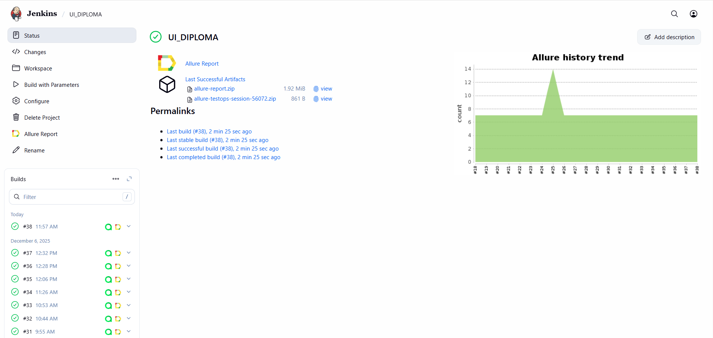
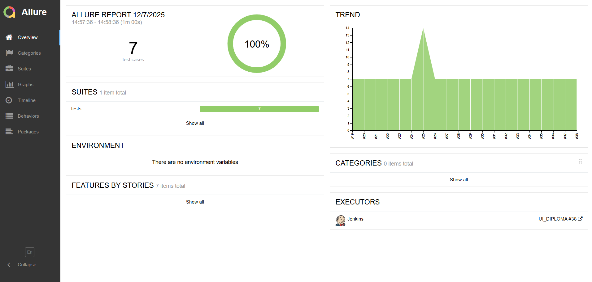
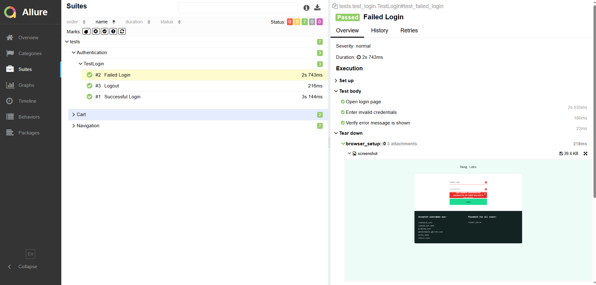
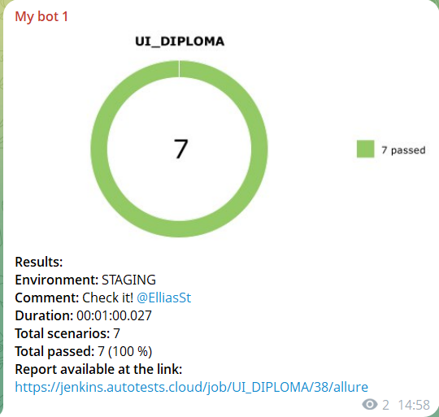

# SauceDemo Test Automation

> Automated UI testing for [SauceDemo](https://www.saucedemo.com/) - a demo e-commerce website

### 🛠 Tech Stack


### Setup

Before running tests, you need to configure environment variables:

1. Create `.env` file in the project root
2. Add your Selenoid credentials:
```bash
SELENOID_LOGIN=user1
SELENOID_PASSWORD=1234
SELENOID_URL=selenoid.autotests.cloud
```

*The .env file is included in .gitignore to prevent accidentally committing credentials.*

### Run Tests

```bash
# Run all tests with Allure reporting
pytest tests/ --alluredir=allure-results -v

# Run single test
pytest tests/simple_po.py::test_successful_login -v

# View Allure report
allure serve allure-results
```


## Test Coverage

### Authentication Module
✅ Successful Login - Valid credentials authentication  
✅ Failed Login - Invalid credentials error handling  
✅ Logout - User session termination

### Shopping Cart Module
✅ Add Item to Cart - Product addition with counter verification  
✅ Remove Item from Cart - Product removal from cart

### Navigation Module
✅ Menu Navigation - Side menu functionality  
✅ Product Filtering - Sort products by price

### Report Examples

#### Jenkins Build


#### Allure Overview  


#### Test Details


#### Telegram Notification


## 👤 Author

**Illia Karcheuski**

[GitHub](https://github.com/Elias373) • [LinkedIn](https://pl.linkedin.com/in/ilyakorchevsky/ru)
