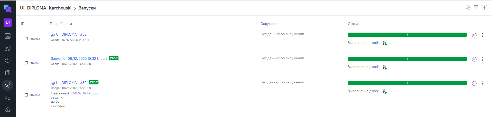
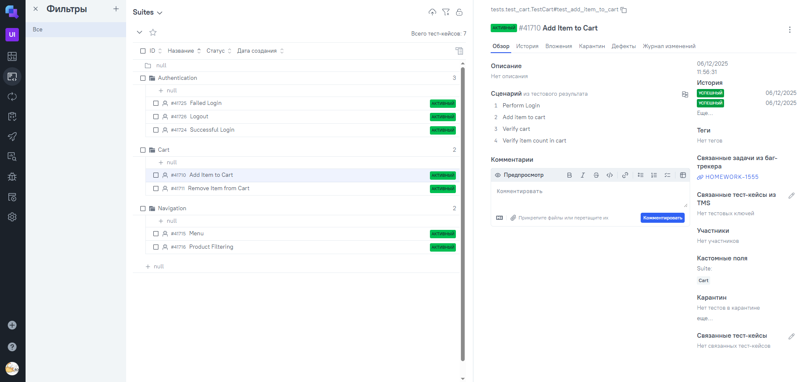

# 🚀 SauceDemo Test Automation

> End-to-end automated testing framework for the demo e-commerce website  
> [SauceDemo](https://www.saucedemo.com/)

---

## Project Overview

Professional test automation framework featuring:

- **Page Object Model (POM)** for maintainable test structure
- **Allure reporting** with screenshots, videos, and detailed steps
- **Selenoid cloud** for scalable browser execution
- **Jenkins CI/CD** with manual job execution
- **Telegram notifications** for real-time results
- **Allure TestOps** integration for test management
- **Jira integration** for defect tracking

---

## 🛠 Tech Stack


---

## Quick Start

### Installation
```bash
# 1. Clone repository
git clone https://github.com/Elias373/sauce_demo_ui_tests.git
cd sauce_demo_ui_tests

# 2. Create virtual environment
python -m venv venv

# 3. Activate virtual environment
source venv/bin/activate      # macOS / Linux
venv\Scripts\activate         # Windows

# 4. Install dependencies
pip install -r requirements.txt
```
### Environment Setup
Create a `.env` file in the project root:
```bash
SELENOID_LOGIN=user1
SELENOID_PASSWORD=1234
```
*The .env file is included in .gitignore to prevent accidentally committing credentials.*

### Run Tests
```bash
# Run all tests
pytest tests/ --alluredir=allure-results -v

# Run a specific test
pytest tests/test_login.py::TestLogin::test_successful_login -v

# View Allure report
allure serve allure-results
```


## ✅ Test Coverage

### Authentication Module
| Test Case | Status | Description |
|-----------|--------|-------------|
| Successful Login | ✅ PASS | Valid credentials authentication |
| Failed Login | ✅ PASS | Invalid credentials error handling |
| Logout | ✅ PASS | User session termination |

### Shopping Cart Module
| Test Case | Status | Description |
|-----------|--------|-------------|
| Add Item to Cart | ✅ PASS | Product addition with counter verification |
| Remove Item from Cart | ✅ PASS | Product removal from cart |

### Navigation Module
| Test Case | Status | Description |
|-----------|--------|-------------|
| Menu Navigation | ✅ PASS | Side menu functionality |
| Product Filtering | ✅ PASS | Sort products by price |

### Report Examples

#### Jenkins Build


#### Allure Overview  


#### Test Details


#### TestOps Runs


#### TestOps Test Cases


#### Jira Integration


#### Telegram Notification


## 👤 Author

**Illia Karcheuski**

[LinkedIn](https://pl.linkedin.com/in/ilyakorchevsky/ru)
